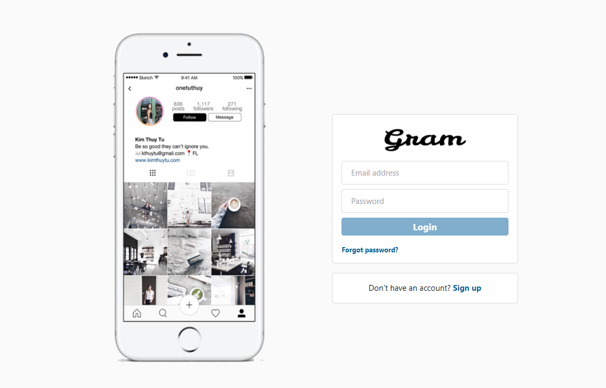
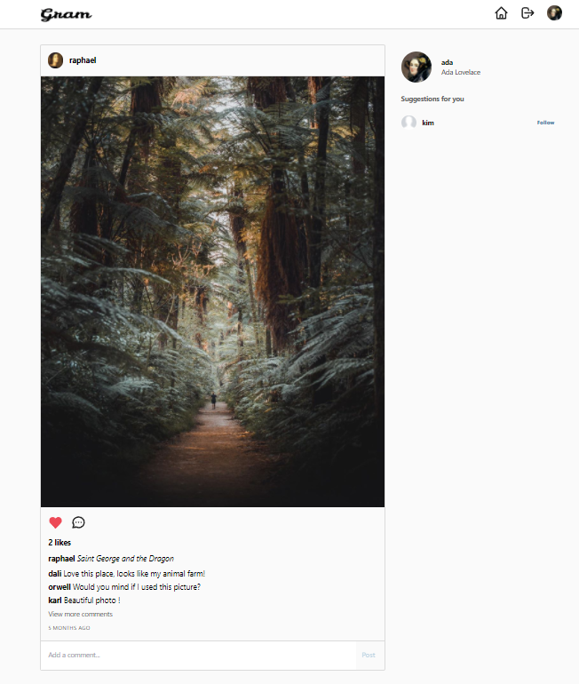
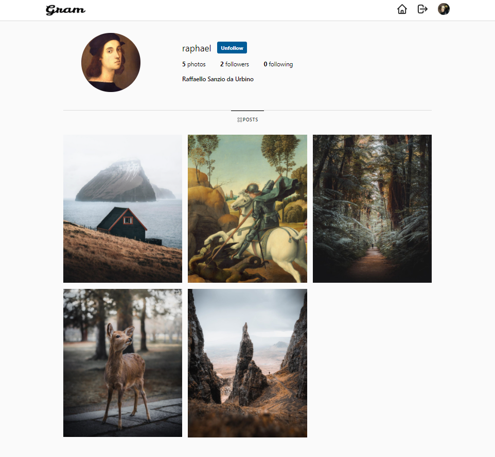

## Gram an Instagram clone using React, Tailwind CSS, Firebase
[Demo](https://insta-clone-pi.vercel.app)
##  Screen (Login)
{:height="100px" width="250px"}

##  Screen (Home)

##  Screen (Profile)

## ✨ 👉Coded for recreational purposes

This app was built using Create React App, Firebase & Tailwind CSS. 
Pages: login, sign up, dashboard & user profile page. 
There are 4 different pages, with public and private routes. 
Firebase firestore handles all the data.

First time using Tailwind CSS, a bit hard to config at the beginning.
First time using Firebase
