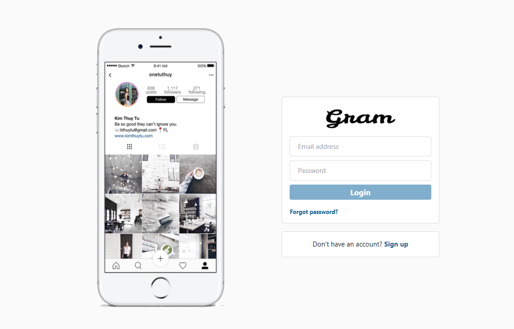

---
Made with 💗 by: [mflores-](https://github.com/mariav7)

## Personal project - Gram an Instagram clone

This app was built using [Create React App](https://create-react-app.dev/), [Firebase](https://firebase.google.com/), [Tailwind CSS](https://tailwindcss.com/) and deployed with [Vercel](https://vercel.com/).

## ✨ NOTE: 👉Coded for Recreational Purposes
This project was developed for recreational purposes and serves as a hands-on experience with technologies such as Tailwind CSS, Firebase, and Vercel. It marks the first-time usage of these tools, and more features are planned for future updates.

---

## Supported feautures

* Use the following credentials to explore the app:
  * username: `test@yopmail.com`
  * password: `123456`
* Account Management: create an account and request a password reset
* Post Interaction: `like` and `deslike` a post
* Engagement: participate in discussions by leaving comments on posts
* Social Connections: build your network by `following` and `unfollowing` other accounts
* Available Pages:
  * Public Routes:
    * Login
    * Sign up
  * Private Routes:
    * Dashboard
    * User profile
* Database Handling: the app utilizes Firebase to manage the database
* Deployment: the app is deployed using Vercel, making it accessible and performant

---

## [Demo](https://gram-clone-pi.vercel.app)

---
